# AI-QQ-Bot 自动化框架 (n8n & NapCat)

<div align="center">

一个用于QQ交互的智能自动化框架，集成了 **n8n** 用于工作流编排和 **NapCat** 用于协议处理。

[](../../LICENSE)
[](https://n8n.io/)
[](https://www.docker.com/)

[**English**](../../README.md) | **简体中文**

</div>

---

## 🏗️ 系统架构

> **用户指南**：GitHub的原生查看器支持高分辨率的 **缩放** 和 **拖拽**。点击下图可进入全屏交互模式。

### 系统部署图

<a href="../architecture/system_infrastructure_solid.png">
  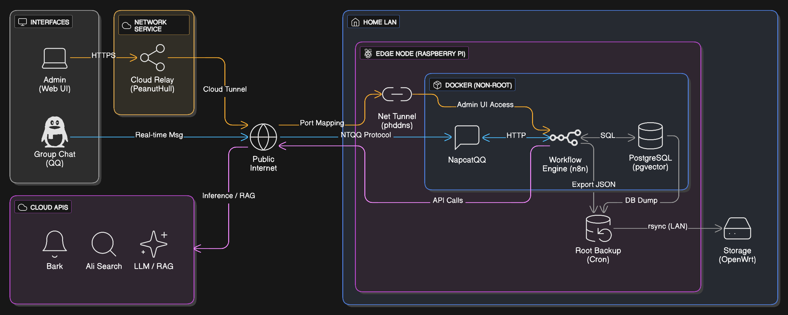
</a>

### 核心逻辑流图

<a href="../architecture/logical_functional_flow_solid.png">
  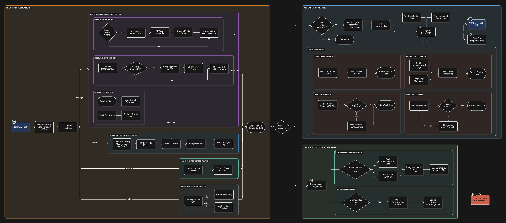
</a>

### 数据库表结构

<a href="../architecture/database_schema_relationship_solid.png">
  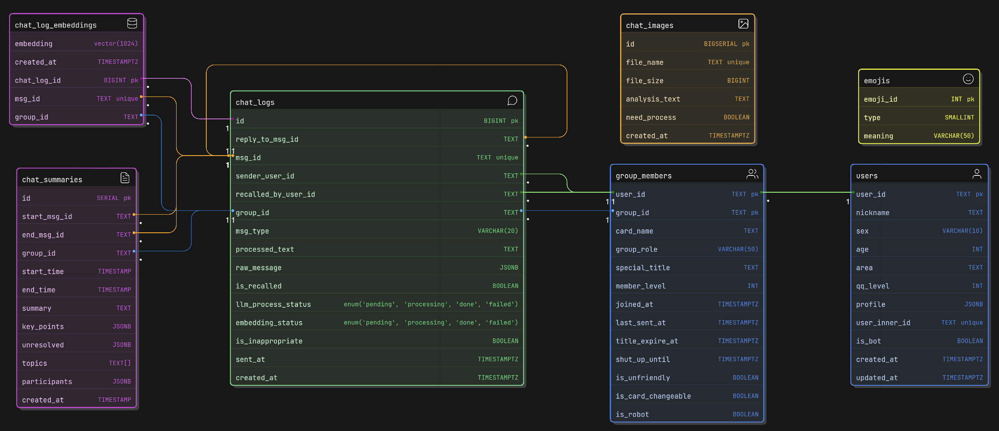
</a>

---


## 📊 工作流展示

### [工作流概览](../workflows/QQBot_Workflows_Overview.png)

<a href="../workflows/QQBot_Workflows_Overview.png">
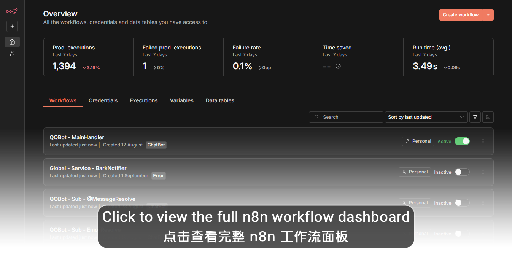
</a>

### 工作流导航

**Main Handler (主处理器)** 是所有QQ消息的入口。所有的子工作流和工具都在下面的可折叠模块中。

#### [Main Handler (主处理器)](../workflows/QQBot_MainHandler.png)

<a href="../workflows/QQBot_MainHandler.png">
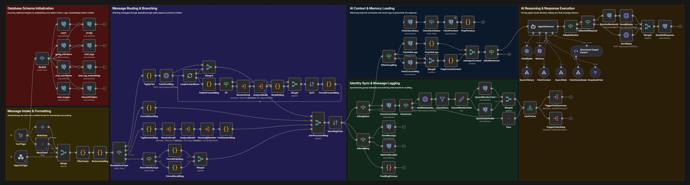
</a>

<details>
<summary><b>📂 点击展开完整的模块画廊 (子流程 & AI工具)</b></summary>

> ### 🧩 类别: 消息处理 (子工作流)
> 
> 
> ##### [Emoji Resolve (Emoji解析)](../workflows/QQBot_Sub_EmojiResolve.png)
> 
> 
> <a href="../workflows/QQBot_Sub_EmojiResolve.png">
> 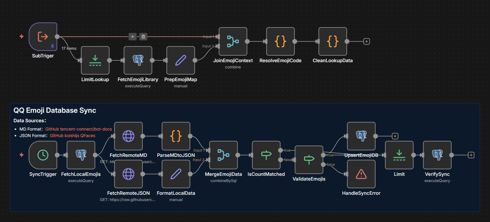
> </a>
>
> ##### [Media Analysis (媒体分析)](../workflows/QQBot_Sub_MediaAnalysis.png)
> 
> <a href="../workflows/QQBot_Sub_MediaAnalysis.png">
> 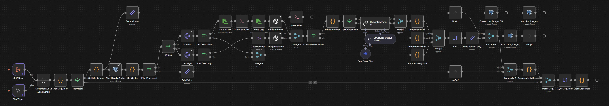
> </a>
>
> ##### [At Message Resolve (@消息处理)](../workflows/QQBot_Sub_AtMessageResolve.png)
> 
> 
> <a href="../workflows/QQBot_Sub_AtMessageResolve.png">
> 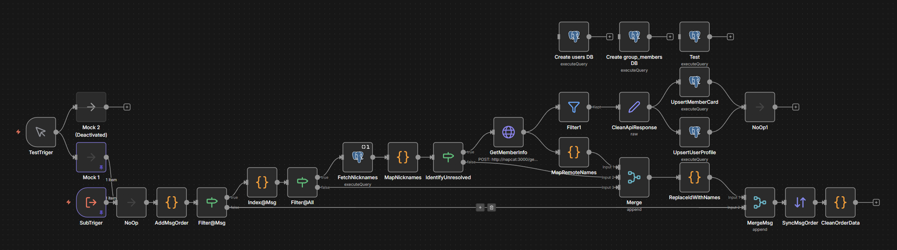
> </a>
>
> ##### [Recent Summary (近期总结)](../workflows/QQBot_Sub_RecentSummary.png)
> 
> 
> <a href="../workflows/QQBot_Sub_RecentSummary.png">
> 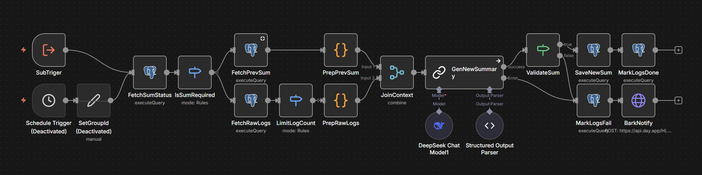
> </a>
>
> ##### [Embedding Service (向量化服务)](../workflows/QQBot_Sub_Embedding.png)
> 
> 
> <a href="../workflows/QQBot_Sub_Embedding.png">
> 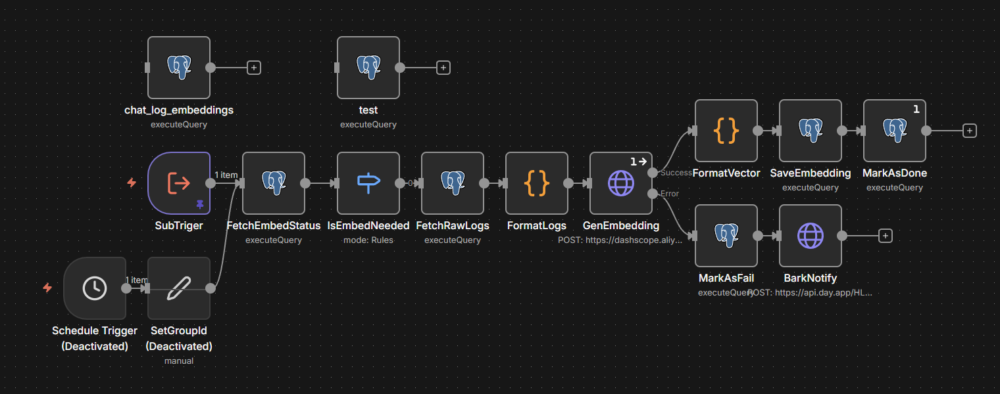
> </a>

> ---

> ### 🔧 类别: AI Agent 工具
> 
> ##### [History Context Tool (历史上下文工具)](../workflows/QQBot_Tool_HistoryContext.png)
> 
> <a href="../workflows/QQBot_Tool_HistoryContext.png">
> 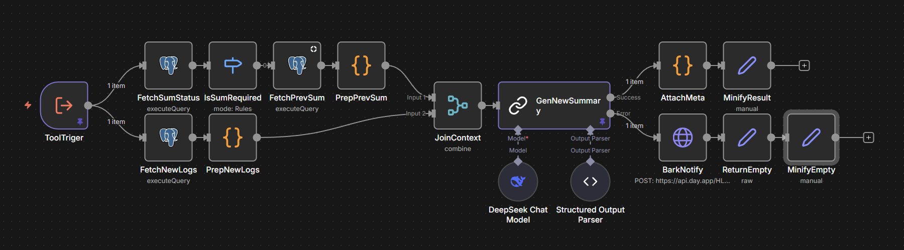
> </a>
>
> ##### [History Search Tool (历史搜索工具)](../workflows/QQBot_Tool_HistorySearch.png)
> 
> <a href="../workflows/QQBot_Tool_HistorySearch.png">
> 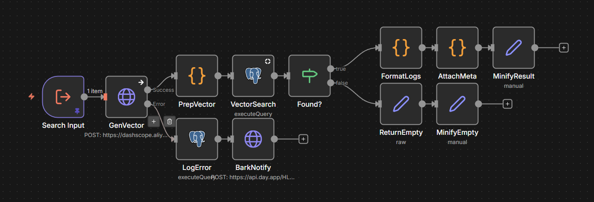
> </a>
>
> ##### [Web Search Tool (网页搜索工具)](../workflows/QQBot_Tool_WebSearch.png)
> 
> 
> <a href="../workflows/QQBot_Tool_WebSearch.png">
> 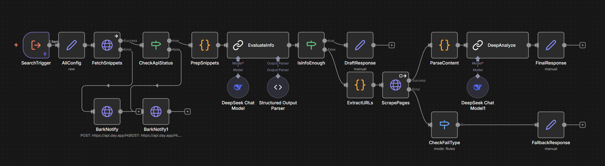
> </a>
>
> ##### [Game Deals Tool (游戏促销工具)](../workflows/QQBot_Tool_GameDeals.png)
> 
> 
> <a href="../workflows/QQBot_Tool_GameDeals.png">
> 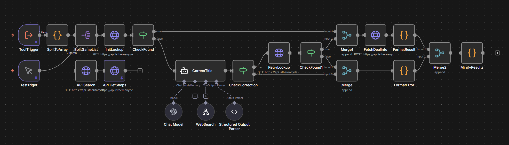
> </a>

> ---

> ### ⚙️ 类别: 系统服务
> 
> 
> ##### [Service Status Monitor (服务状态监视器)](../workflows/QQBot_Service_StatusMonitor.png)
> 
> 
> <a href="../workflows/QQBot_Service_StatusMonitor.png">
> 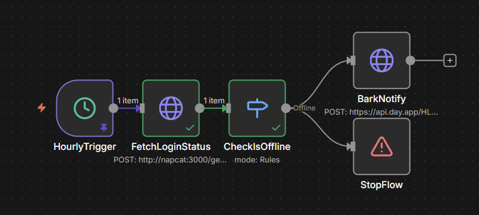
> </a>
>
> ##### [Bark Notifier Service (Bark通知服务)](../workflows/Global_Service_BarkNotifier.png)
> 
> 
> <a href="../workflows/Global_Service_BarkNotifier.png">
> 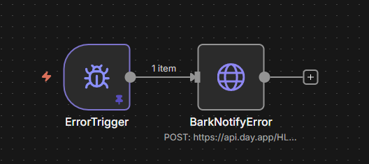
> </a>

</details>

---

## 🚀 部署与设置指南

本指南详细介绍了部署n8n和napcat服务以及配置它们协同工作的步骤。

### 1. 初始环境设置

在启动容器之前，您需要配置环境并设置共享的Docker网络。

1.  **配置环境文件:**
    *   编辑 [`../../deploy/n8n-compose/.env`](../../deploy/n8n-compose/.env) 和 [`../../deploy/napcat-compose/.env`](../../deploy/napcat-compose/.env) 以匹配您的本地设置（例如，为`N8N_HOST`设置您的域，为`NAPCAT_UID`/`NAPCAT_GID`设置用户/组ID等）。

2.  **创建Docker网络:**
    这些服务通过一个共享的Docker网络进行通信。使用以下命令创建它，网络名称在您的`.env`文件中定义：
    ```bash
    docker network create napcat-n8n-network
    ```

### 2. 部署容器

环境配置完成后，使用Docker Compose启动服务。建议首先启动`n8n`技术栈。

1.  **启动 n8n 服务:**
    ```bash
    cd deploy/n8n-compose
    docker compose up -d --build
    ```

2.  **启动 napcat 服务:**
    ```bash
    cd deploy/napcat-compose
    docker compose up -d --build
    ```

### 3. 访问服务与登录

1.  **n8n Web UI:**
    *   通过您在 [`../../deploy/n8n-compose/.env`](../../deploy/n8n-compose/.env) 中为 `N8N_HOST` 变量配置的域访问n8n（例如, `http://your.domain.com`）。

2.  **napcat Web UI:**
    *   通过您服务器的IP和其 [`.env`](../../deploy/napcat-compose/.env) 文件中定义的 `NAPCAT_WEB_PORT` 访问napcat Web界面。例如: `http://192.168.1.100:6099/webui/`。

3.  **napcat QQ 登录:**
    您需要通过扫描二维码登录QQ。您可以通过两种方式获取此代码：
    *   **方法一 (命令行):** 查看容器日志以获取二维码图片链接。容器名称在 [`../../deploy/napcat-compose/.env`](../../deploy/napcat-compose/.env) 中定义。
        ```bash
        docker logs napcat
        ```
    *   **方法二 (Web UI):** 在napcat Web界面中, 导航至 "猫猫日志" -> "历史日志" 查找二维码。
    *   使用您的手机QQ应用扫描二维码以完成登录。

### 4. 应用与工作流配置

此步骤在将工作流导入n8n之前准备配置。

1.  **修改工作流占位符:**
    *   编辑 [`../../scripts/workflow_configurator.py`](../../scripts/workflow_configurator.py) 中的 `SENSITIVE_MAP` 字典, 特别是 `# Infrastructure & Tokens` 部分，以匹配您环境的真实值（例如，您实际的Bark令牌、API密钥等）。

2.  **运行配置脚本:**
    此脚本将使用您刚在 `SENSITIVE_MAP` 中设置的真实值替换本地工作流文件中的占位符。
    ```bash
    python scripts/workflow_configurator.py
    ```

### 5. 最终n8n设置

准备好工作流后，将它们导入并在n8n内部设置必要的凭证。

1.  **将工作流导入n8n:**
    *   导航到您的n8n Web UI。
    *   手动从 [`../../n8n/workflows/`](../../n8n/workflows/) 目录导入现在已配置好的JSON文件。

2.  **在n8n UI中配置凭证:**
    导入后，您的工作流需要配置它们所使用服务的凭证才能正确运行。在n8n UI中，找到相应的节点并创建/选择凭证：
    *   **NapCat Token:** 您将在napcat HTTP服务器中创建的私有令牌（见下一步）。
    *   **LLM APIs:** 如DeepSeek、Qwen等服务的API密钥。
    *   **Search APIs:** 如阿里云搜索等服务的凭证。

### 6. 最终napcat设置

最后，配置napcat与n8n通信。

1.  **napcat连接配置:**
    登录到napcat Web UI并导航到"网络配置"部分。
    *   **创建一个 "HTTP 服务器":**
        *   **Host:** `0.0.0.0`
        *   **Port:** `3000` (这对应于 [`../../scripts/workflow_configurator.py`](../../scripts/workflow_configurator.py) 中的`REDACTED_NAPCAT_HOST`的主机和端口)。
        *   **消息格式:** `Array`
        *   **Token:** 创建一个安全的私有令牌。这个相同的令牌必须在n8n的NapCat凭证中使用（见步骤5.2）。
    *   **创建一个 "HTTP 客户端":**
        *   **URL:** `http://n8n:5678/webhook/napcat-webhook` (这个URL对应于 [`../../scripts/workflow_configurator.py`](../../scripts/workflow_configurator.py) 中的 `REDACTED_NAPCAT_WEBHOOK_NAME`)。
        *   **上报自身消息:** `True`
        *   **Token:** 留空。为增加安全性，您可以在此处设置一个令牌，并在您的n8n工作流中的 `NapCatTriger` webhook节点后添加一个 `IF` 节点，以手动检查`Bearer` header是否匹配。


---

## 🛠️ 维护与脚本

* **[`workflow_configurator.py`](../../scripts/workflow_configurator.py)**: 一个Python实用程序，用于在将工作流导入n8n之前，用您的实际私有值替换工作流文件中的占位符。
* **[`backup_to_samba_template.sh`](../../scripts/backup_to_samba_template.sh)**: 一个模板脚本，用于自动将整个项目（n8n数据、Postgres数据库和compose文件）备份到远程Samba共享。

---

## 📂 仓库结构

```text
ai-qq-bot-n8n/
├── deploy/               # Docker Compose 部署栈
│   ├── n8n-compose/      # n8n, Traefik, 和 Postgres 技术栈
│   │   ├── compose.yaml
│   │   ├── .env.template
│   │   └── .env
│   └── napcat-compose/   # napcat 技术栈
│       ├── docker-compose.yml
│       ├── .env.template
│       └── .env
├── n8n/
│   └── workflows/        # 用于公开的、已脱敏的 n8n 工作流JSON文件
├── scripts/              # 项目维护工具
│   ├── backup_to_samba_template.sh
│   └── workflow_configurator.py
└── README.md
```

---

## 🙏 致谢与资源

本项目的构建与运行离不开以下优秀开源项目和服务的支持。

| 项目 / 服务 | 类别 | 链接与用途 |
| :--- | :--- | :--- |
| n8n | 核心框架 | [](https://docs.n8n.io/hosting/installation/docker/) |
| NapCat | 核心框架 | [](https://github.com/NapNeko/NapCat.Docker.Framework) |
| 贝锐花生壳 | 部署与服务 | [](https://hsk.oray.com/) |
| IsThereAnyDeal | 部署与服务 | [](https://isthereanydeal.com/apps/) |
| DeepSeek | AI API | [](https://platform.deepseek.com/api_keys) |
| 阿里云百炼 | AI API | [](https://bailian.console.aliyun.com/tab=model#/api-key) |
| OpenAI API | AI API (备选) | [](https://openai.com/index/openai-api/) |
| 阿里云开放搜索 | 搜索 API | [](https://opensearch.console.aliyun.com/cn-shanghai/rag/api-key) |
| 谷歌搜索 API | 搜索 API (备选) | [](https://console.cloud.google.com/apis/dashboard) |
